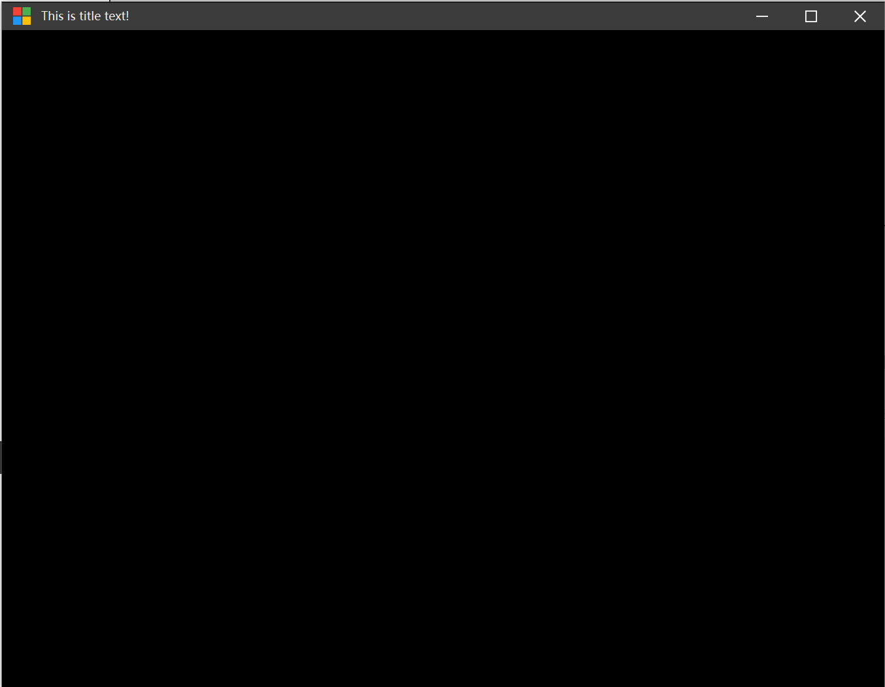

# QFramelessWindow

带标题栏的Qt跨平台无边框窗口。

使用[QWindowKit](https://github.com/stdware/qwindowkit)库，参考了其[Example](https://github.com/stdware/qwindowkit/tree/main/examples)的代码，对其进行了部分修改，使用的版本为[Fork](https://github.com/NoCaiTnT/qwindowkit)的版本。

使用的是编译后的.pri文件，对[QWindowKit](https://github.com/stdware/qwindowkit)库进行编译的操作参考其[README](https://github.com/stdware/qwindowkit/blob/main/README.md)文件。

## 特性

1.  支持窗口上、下、左、右、左上、左下、右上、右下八个方向的拖拽拉伸。
2.  标题栏包括左上角图标、文字、最小化、最大化、关闭按钮，支持双击放大、拖拽、最大化推拽。
3.  基类为QMainWindow，支持其自带的函数。
4.  使用QSS控制窗口样式，清晰方便。

## 效果图
Win11效果图

Win10效果图

Ubuntu22.04效果图


## 环境
Windows:

1. Qt Creator 12.0.1 (Community)
2. Qt 6.6.1
3. MinGW 11.2.0 64-bit
4. CMake 3.27.7
5. Ninja 1.10.2
6. Add qwindowkit/bin to PATH

Linux:

1. Qt Creator 12.0.1 (Community)
2. Qt 6.6.1
3. GCC 11.4.0 64-bit
4. CMake 3.27.7
5. Ninja 1.10.2

## 使用举例

1.  创建一个类，直接继承该类。

    ```纯文本
    class Example : public QFramelessWindow
    ```

2.  设置标题栏图标。

    1）不设置：标题栏不会存在图标。

    2）设置，但不输入参数：标题栏存在默认图标。

    ```纯文本
    this->setIconButton();
    ```

    3）设置，输入图标路径：标题栏存在该路径图标。

    ```纯文本
    this->setIconButton(":/Resources/TitleBar/appIcon.png");
    ```

3.  设置标题栏文字。

    1）不设置：标题栏不存在文字。

    2）设置：标题栏存在文字。

    ```纯文本
    this->setTitleText("This is title text!");
    ```

4.  设置主题。

    目前只有两种，Dark以及Light，通过加载不同的QSS文件实现。

    1）不设置：默认黑色主题。

    2）设置：根据参数变更主题。

    ```纯文本
    this->setTheme(QFramelessWindow::Dark);
    ```

5.  设置自定义的标题栏。

    若不想使用默认标题栏，可以自定义标题栏进行使用，使用QMainWindow自带的函数即可。

    ```纯文本
    QWidget *title_bar_;
    setMenuWidget(title_bar_);
    ```

6.  设置窗口内容。

    使用QMainWindow自带的函数即可。

    ```纯文本
    Qwidget *central_widget;
    setCentralWidget(central_widget);
    ```
